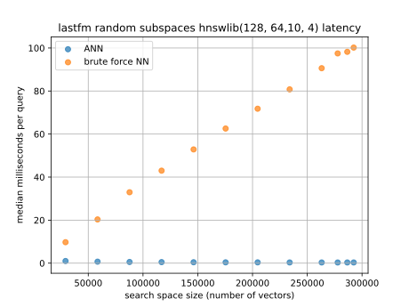

# ANN benchmarks with category filters
Practical nearest neighbor search needs filtering, but filtering introduces counterintuitive performance penalties.


## Results

### hnswlib on random subspaces of last.fm dataset



### hnswlib on genre subspaces of last.fm dataset


### Weaviate


## Run benchmarks
Install:
```{bash}
python -m venv .venv
. .venv/bin/activate
pip install --upgrade pip
pip install implicit h5py
```

hnswlib (https://github.com/nmslib/hnswlib, with modification for filtering):
```{bash}

pip install git+https://github.com/gtsoukas/hnswlib.git@add_python_filter

python -m filtered_ann_benchmarks.hnswlib_lastfm_random

python -m filtered_ann_benchmarks.hnswlib_lastfm_genres
```

Weaviate (https://weaviate.io/):
```{bash}
# setup a running instance before running benchmark, see weaviate/Readme.md
pip install weaviate-client

python -m filtered_ann_benchmarks.weaviate_lastfm
```

## Extend benchmarks
Scenarios where you might want to extend this benchmark:
* Benchmark a new algorithm/library/database engine.
* Evaluate filtered vector search for a different dataset.
* Evaluate a different set of parameters, e.g. change k.


Subclass the abstract Benchmark class defined in the benchmark module. Within
Benchmark subclass define the dataset, the subspaces of the dataset to be
queried as well as the query function. See hnswlib_lastfm_genres.py for an
example.

Pull request are welcome. Please run the following before a pull request. 
```{bash}
export PYTHONPATH=.:$PYTHONPATH
pylint filtered_ann_benchmarks/*.py
black filtered_ann_benchmarks/*.py
python -m unittest tests/*.py
```

## Limitations
* Only top-k items for user queries are supported.
* Only inner product queries are supported.
